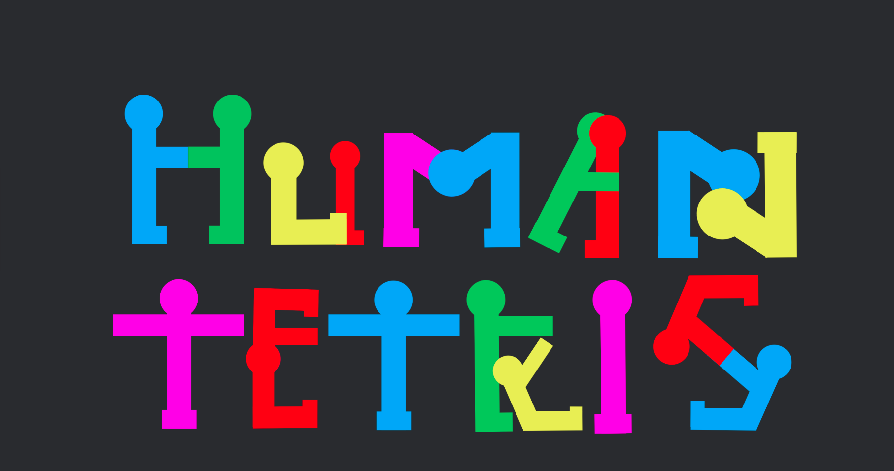

## By Milo Calvo-Platero, Sam Miller, Maksim Pesetski and Danny Gutmann

### [Human Tetris](https://humantetris.firebaseapp.com/) is a web game based on the Japanese game show called [Brain Wall](https://www.youtube.com/watch?v=vfCcq116WgE) that users can play on a website. The player sees their body on the monitor using a webcam, where the objective is to try and fit their body into a “safe zone” before an eight-second timer ends. If the player is able to fit their whole body inside, they move onto the next level with a differently shaped “safe zone”. If they fail to do this, the game ends and their score is recorded to a database. The player's bodies are tracked via PoseNet, the safe zones are rendered to the screen by p5.js, and to check if the player's body is fully in the safe zone we use p5.collide2D. We used Firebase for storing and retrieving information, authentication, and game score. 

# Technologies
  We had to find ways to integrate various technologies in order to get our game fully functional. Each one provided a specific part of the game and all together they allowed us to transform [Brain Wall](https://www.youtube.com/watch?v=vfCcq116WgE) into web form!

## PoseNet
  [PoseNet](https://github.com/google-coral/project-posenet) is a javascript library that was built on top of ML5 in order to constantly improve the accuracy of the technology. It tracks 17 key points across people's bodies.

## p5.js
[p5.js](https://github.com/processing/p5.js?files=1) is a javascript library that allows for the creation of graphic experiences and has various sub libraries. The parts of p5 that were integral to our game were canvas, p5.collide2d.js and p5.sound.js.

### Canvas
[p5.createCanvas](https://github.com/processing/p5.js/wiki/Getting-started-with-WebGL-in-p5) function creates a canvas element in the document, and sets the dimensions of it in pixels. We used created canvas to draw a video on it and then shapes with directions for the game process to create a unique UI.

### p5.Collide2D.js
[p5.Collide2D.js](https://github.com/bmoren/p5.collide2D) is a collision algorithm that allowed us to check if the user’s body is within the current shape by calculating collision between the window shape and all 17 player’s body keypoints.

### p5.Sound.js
[p5.Sound.js](https://github.com/processing/p5.js-sound) is a library that allowed us to play music during the game process to help players get a full game experience.

### Firebase Authentication
[Firebase’s Authentication](https://firebase.google.com/products/auth/)

### Firebase Firestore
[Firestore](https://firebase.google.com/products/firestore/) is a NoSQL document database that this project uses to store signed up users and their scores. Two collections are stored in the database, the high scores leaderboard collection and and a collection of all users and their scores. 

# Installation
Run ‘npm install’ within the website folder
Run ‘npm run start dev’ to run the website locally
In order to run this repository locally, you will need to setup your own firebase hosted project, with firestore cloud database enabled. Please see instructions at [https://firebase.google.com/docs/web/setup] and ensure API keys are saved in a gitignored secrets file.

#Presentation
Please, feel free to checkout the project presentation (HERE)[https://youtu.be/TcYCWliA7PI]

You can play the game at https://humantetris.web.app